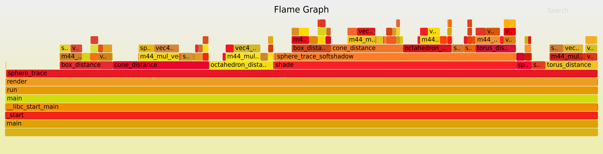

Cache misses don't seem to be an issue. For L1 cache we only have a 0.01% miss rate:

```
$ perf stat -e L1-dcache-loads,L1-dcache-load-misses,L1-dcache-stores ./main opt1 ../scenes/benchmark_small/all.json 1920 1080
Reference scene already loaded (../scenes/benchmark_small/all.json), converting to required format
Width: 1920
Height: 1080
Cycles: 199658388847
Microseconds: 60537721
Seconds: 60.54

 Performance counter stats for './main opt1 ../scenes/benchmark_small/all.json 1920 1080':

   108,177,156,267      L1-dcache-loads:u                                             (66.67%)
        15,979,890      L1-dcache-load-misses:u   #    0.01% of all L1-dcache accesses  (66.67%)
     9,509,281,556      L1-dcache-stores:u                                            (66.66%)

      60.553875960 seconds time elapsed

      60.379743000 seconds user
       0.016490000 seconds sys
```

The the last-level cache we have a 5% miss rate but we barely have any accesses to the cache:

```
perf stat -e LLC-loads,LLC-load-misses,LLC-stores,LLC-prefetches ./main opt1 ../scenes/benchmark_small/all.json 1920 1080
Reference scene already loaded (../scenes/benchmark_small/all.json), converting to required format
Width: 1920
Height: 1080
Cycles: 199132158392
Microseconds: 60378156
Seconds: 60.38

 Performance counter stats for './main opt1 ../scenes/benchmark_small/all.json 1920 1080':

         1,698,782      LLC-loads:u                                                   (66.66%)
            91,405      LLC-load-misses:u         #    5.38% of all LL-cache accesses  (66.67%)
           255,356      LLC-stores:u                                                  (66.67%)
   <not supported>      LLC-prefetches:u

      60.393797408 seconds time elapsed

      60.226797000 seconds user
       0.009982000 seconds sys
```

The TLB also isn't a bottleneck.

```
$ perf stat -e dTLB-loads,dTLB-load-misses,dTLB-prefetch-misses ./main opt1 ../scenes/benchmark_small/all.json 1920 1080
Reference scene already loaded (../scenes/benchmark_small/all.json), converting to required format
Width: 1920
Height: 1080
Cycles: 199383155252
Microseconds: 60454262
Seconds: 60.45

 Performance counter stats for './main opt1 ../scenes/benchmark_small/all.json 1920 1080':

   108,175,942,788      dTLB-loads:u
            28,270      dTLB-load-misses:u        #    0.00% of all dTLB cache accesses
   <not supported>      dTLB-prefetch-misses:u

      60.471002364 seconds time elapsed

      60.131255000 seconds user
       0.135561000 seconds sys
```

The size breakdown from `perf report -s sym,srcline` looks like this:

```
+   99.88%     0.00%  [.] _start                              _start+93979687346221
+   99.88%     0.00%  [.] __libc_start_main                   __libc_start_main+140446271316180
+   99.88%     0.00%  [.] main                                main.cpp:228
+   99.88%     0.00%  [.] run                                 main.cpp:137
+   99.73%     0.02%  [.] impl::opt1::render                  impl.cpp:371
+   40.93%     0.01%  [.] impl::opt1::sphere_trace            impl.cpp:316
+   33.65%     0.00%  [.] impl::opt1::shade                   impl.cpp:165
+   22.81%    22.81%  [.] impl::opt1::sphere_trace            geometry.h:161
+   16.97%     1.13%  [.] impl::opt1::sphere_trace            impl.cpp:286
+   15.08%    15.08%  [.] impl::opt1::shade                   geometry.h:161
+   14.08%     0.00%  [.] vec4_dot (inlined)                  geometry.h:161
+   12.50%     0.00%  [.] sphere_trace_softshadow (inlined)   impl.cpp:93
+   12.32%     1.08%  [.] impl::opt1::sphere_trace            impl.cpp:305
+   10.44%     1.52%  [.] impl::opt1::sphere_trace            impl.cpp:267
+    9.55%     1.26%  [.] impl::opt1::sphere_trace            impl.cpp:248
+    9.22%     0.00%  [.] vec4_dot (inlined)                  geometry.h:161
+    8.66%     0.00%  [.] m44_mul_vec (inlined)               geometry.h:241
+    8.62%     0.00%  [.] sphere_trace_softshadow (inlined)   impl.cpp:109
+    8.02%     0.00%  [.] m44_mul_vec (inlined)               geometry.h:242
+    7.32%     0.00%  [.] sphere_trace_softshadow (inlined)   impl.cpp:61
+    7.18%     0.00%  [.] sphere_trace_softshadow (inlined)   impl.cpp:77
+    7.05%     0.00%  [.] shade (inlined)                     impl.cpp:165
+    6.90%     0.00%  [.] m44_mul_vec (inlined)               geometry.h:241
+    6.82%     0.00%  [.] cone_distance (inlined)             scene.hpp:222
+    5.87%     0.00%  [.] octahedron_distance (inlined)       scene.hpp:268
+    5.75%     0.00%  [.] torus_distance (inlined)            scene.hpp:193
+    5.52%     0.00%  [.] m44_mul_vec (inlined)               geometry.h:243
+    5.04%     5.04%  [.] impl::opt1::shade                   geometry.h:133
+    4.77%     4.77%  [.] impl::opt1::sphere_trace            geometry.h:133
+    4.67%     0.00%  [.] cone_distance (inlined)             scene.hpp:222
+    4.35%     0.00%  [.] box_distance (inlined)              scene.hpp:147
+    4.34%     0.00%  [.] vec2_dot2 (inlined)                 geometry.h:137
+    4.29%     0.00%  [.] m44_mul_vec (inlined)               geometry.h:243
+    4.19%     0.00%  [.] vec2_dot2 (inlined)                 geometry.h:137
+    4.08%     0.00%  [.] torus_distance (inlined)            scene.hpp:193
+    3.89%     0.00%  [.] m44_mul_vec (inlined)               geometry.h:242
...
```

The shading takes a substantial portion of the rendering time with most of the
time spent inside the distance functions.
Around 27% of time is spend in `m44_mul_vec`.


